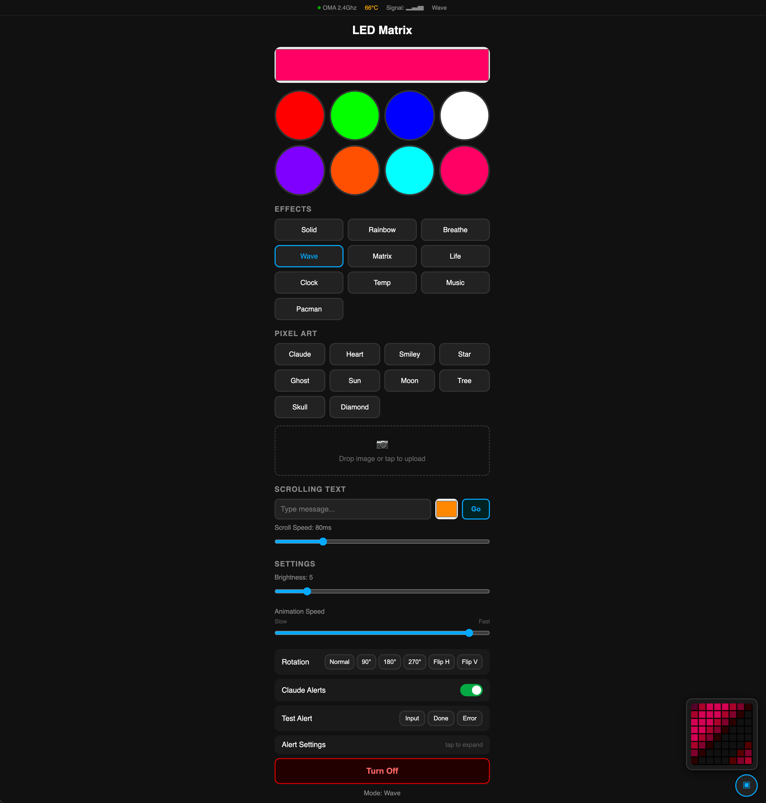

# ESP32 Pixel Matrix

A lightweight, single-file ESP32 firmware for driving an 8x8 WS2812B LED matrix with a beautiful mobile-first web UI. Features pixel art, image upload, scrolling text, visual effects, NTP clock, and a notification API for developer tool integrations.

<!--  -->

## Features

- **Mobile-first Web UI** — Clean, responsive interface accessible from any device
- **7 Visual Effects** — Solid color, rainbow, breathe, wave, matrix rain, Game of Life, NTP clock
- **11 Built-in Pixel Art Icons** — Heart, smiley, star, ghost, music note, skull, and more
- **Image Upload** — Drop any image, auto-resized to 8x8 with live preview (binary RGB, fast)
- **Scrolling Text** — Custom message with configurable color and speed
- **Notification API** — Trigger visual alerts (input/done/error) from external tools
- **Rotation & Flip** — 6 orientation modes (0/90/180/270 + horizontal/vertical flip)
- **mDNS** — Access via `http://esp32matrix.local`
- **CORS Enabled** — Easy API integration from any origin
- **Boot Button** — Physical toggle on GPIO0

## Hardware

| Component | Details |
|-----------|---------|
| **Microcontroller** | ESP32-S3 (or any ESP32 with WiFi) |
| **LED Matrix** | WS2812B 8x8 (64 LEDs) |
| **Data Pin** | GPIO 14 |
| **Power** | 5V, ~2A recommended for full brightness |

### Wiring

```
ESP32 GPIO14 ──── DIN (WS2812B)
ESP32 GND    ──── GND (WS2812B)
ESP32 5V     ──── VCC (WS2812B)
```

> Use a level shifter (3.3V → 5V) on the data line for reliable communication, or keep the data wire short (<10cm).

## Quick Start

### 1. Clone & Configure

```bash
git clone https://github.com/ogulcanaydogan/esp32-pixel-matrix.git
cd esp32-pixel-matrix
```

Copy the credentials template and fill in your WiFi details:

```bash
cp credentials.example.h credentials.h
```

Edit `credentials.h`:
```cpp
const char* WIFI_SSID = "Your_WiFi_SSID";
const char* WIFI_PASS = "Your_WiFi_Password";
```

### 2. Upload (Arduino IDE)

1. Install [Arduino IDE](https://www.arduino.cc/en/software)
2. Add ESP32 board support: `https://raw.githubusercontent.com/espressif/arduino-esp32/gh-pages/package_esp32_index.json`
3. Install library: **Adafruit NeoPixel**
4. Select your ESP32 board and port
5. Upload `esp32-matrix-test.ino`

### 3. Upload (arduino-cli)

```bash
arduino-cli lib install "Adafruit NeoPixel"
arduino-cli compile --fqbn esp32:esp32:esp32s3 esp32-matrix-test.ino
arduino-cli upload --fqbn esp32:esp32:esp32s3 -p /dev/cu.usbmodem101 esp32-matrix-test.ino
```

### 4. Connect

Open `http://esp32matrix.local` or check Serial Monitor for the IP address.

## API Reference

All endpoints accept GET requests unless noted. Base URL: `http://esp32matrix.local`

| Endpoint | Method | Parameters | Description |
|----------|--------|------------|-------------|
| `/` | GET | — | Web UI |
| `/color` | GET | `hex` (6-char hex, e.g. `ff0000`) | Set solid color |
| `/mode` | GET | `m` (0-8) | Set mode (see below) |
| `/brightness` | GET | `v` (1-30) | Set brightness |
| `/speed` | GET | `v` (10-500) | Set animation speed (ms) |
| `/toggle` | GET | — | Toggle LEDs on/off |
| `/rotation` | GET | `v` (0-5) | Set rotation (0=normal, 1=90, 2=180, 3=270, 4=flipH, 5=flipV) |
| `/bitmap` | GET | `name` | Show built-in pixel art |
| `/upload-bitmap` | POST | Binary body (192 bytes, raw RGB) | Upload custom 8x8 image |
| `/text` | GET | `msg`, `color` (hex), `speed` (ms) | Scroll text |
| `/notify` | GET | `type` (input/done/error/clear) | Trigger notification animation |
| `/alerts` | GET | `v` (0/1) | Enable/disable alerts |
| `/status` | GET | — | Get current state (JSON) |

### Modes

| ID | Name |
|----|------|
| 0 | Solid |
| 1 | Rainbow |
| 2 | Breathe |
| 3 | Wave |
| 4 | Matrix Rain |
| 5 | Bitmap / Pixel Art |
| 6 | Scrolling Text |
| 7 | Game of Life |
| 8 | NTP Clock |

### Built-in Pixel Art

`claude`, `heart`, `smiley`, `star`, `music`, `ghost`, `sun`, `moon`, `tree`, `skull`, `diamond`

### Upload Image Example

```bash
# Upload raw RGB binary (192 bytes for 8x8)
python3 -c "
from PIL import Image
img = Image.open('myimage.png').resize((8,8)).convert('RGB')
import requests
requests.post('http://esp32matrix.local/upload-bitmap', data=img.tobytes())
"
```

## Notification Integration

The `/notify` endpoint lets external tools trigger visual alerts on the matrix. This is useful for CI/CD pipelines, chat bots, or developer tool hooks.

### Claude Code Hook

Add to `.claude/hooks.json`:

```json
{
  "hooks": [
    {
      "event": "notification",
      "command": "curl -s 'http://esp32matrix.local/notify?type=$NOTIFICATION_TYPE'"
    }
  ]
}
```

### Usage Examples

```bash
# Waiting for input — warm orange pulse
curl "http://esp32matrix.local/notify?type=input"

# Task completed — green sweep
curl "http://esp32matrix.local/notify?type=done"

# Error occurred — red flash
curl "http://esp32matrix.local/notify?type=error"

# Clear notification, return to previous mode
curl "http://esp32matrix.local/notify?type=clear"
```

## USB Serial Controller (Optional)

`controller.py` provides an alternative USB serial interface with its own web UI. Useful for development without WiFi.

```bash
pip install flask pyserial
python controller.py
# Open http://localhost:5555
```

## Project Structure

```
esp32-pixel-matrix/
├── esp32-matrix-test.ino   # Main firmware (single file)
├── bitmaps.h               # Built-in pixel art (11 icons)
├── fonts.h                 # 5x7 bitmap font (ASCII 32-126)
├── credentials.h           # WiFi credentials (gitignored)
├── credentials.example.h   # Credentials template
├── controller.py           # USB serial controller (optional)
├── LICENSE                 # MIT
└── README.md
```

## License

MIT
